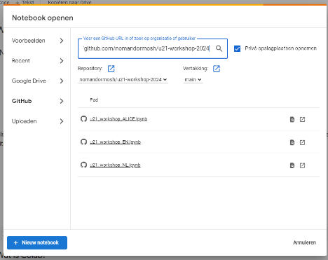
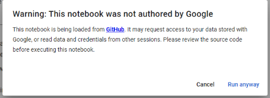

**Instructions:**
1. Open the browser and navigate to Google’s Colab, then click on the sign in button
   <https://colab.research.google.com/>

2. Login using your google account username and password
3. You will see “Open notebook” window
   * Click on github from the left tabs
   * Cancel the authorization procedure
   * Fill in the URL <https://github.com/nomandormosh/u21-workshop-2024>
     
  { style="display: block; margin: 0 auto" }

4. Select the desired notebook.
   * U21\_workshop\_EN -> for heart failure ESC guidelines (English)
   * U21\_workshop\_NL -> for heart failure ESC guidelines (Dutch)
   * U21\_workshop\_ALICE -> for Alice’s Alice's Adventures in Wonderland
5. When you run your first code you will get the following warning message which you can safely ignore

   { style="display: block; margin: 0 auto" }

7. Good luck!

